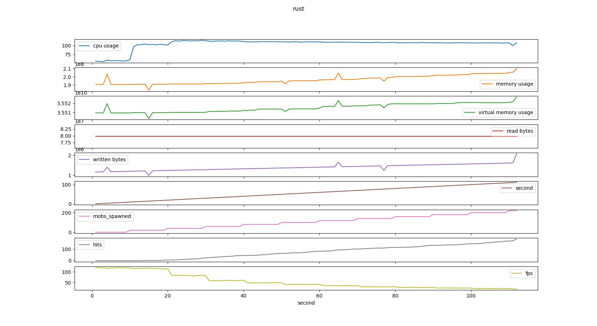
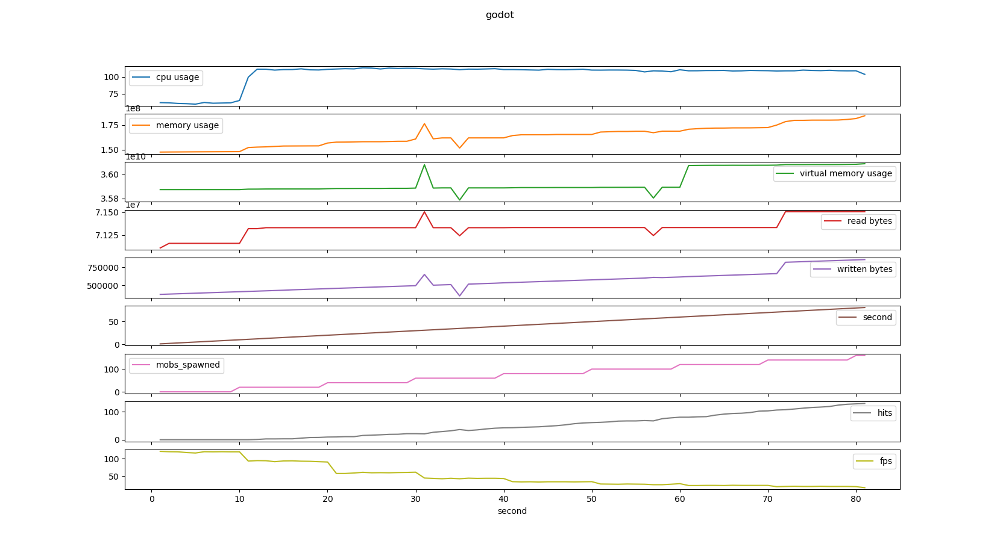
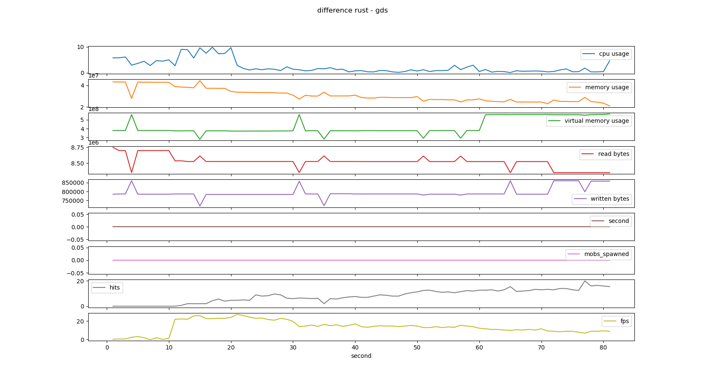

# pandas-plotter (gdext evaluation project)

This is part of a project to evaluate the godot-rust bindings [gdext](https://github.com/godot-rust/gdext).

The evaluation project consists of four Repositories:

- [this](https://github.com/franziskusz/pandas-plotter)
- [Godot Rust benchmark game](https://github.com/franziskusz/dodge-r)
- [Godot GDScript benchmark game](https://github.com/franziskusz/dodge-gds)
- [process-logger](https://github.com/franziskusz/process-logger)

This script is meant to be used to process and plot the data collected by the above mentioned applications. Like described in the readme files of the [Godot Rust benchmark game](https://github.com/franziskusz/dodge-r) and the [Godot GDScript benchmark game](https://github.com/franziskusz/dodge-gds) a complete test run will yield a total of four folders containing .csv files. This script takes those folders as command line arguments during invocation in the following order:
1. rust-godot (from [Godot Rust benchmark game](https://github.com/franziskusz/dodge-r))
2. rust-process (from ([process-logger](https://github.com/franziskusz/process-logger) while running the [Godot Rust benchmark game](https://github.com/franziskusz/dodge-r))
3. gds-godot (from [Godot GDScript benchmark game](https://github.com/franziskusz/dodge-gds))
4. gds-process (from ([process-logger](https://github.com/franziskusz/process-logger) while running the [Godot GDScript benchmark game](https://github.com/franziskusz/dodge-gds))

### IMPORTANT
- It should not matter how many test runs are done before running this script, BUT:
- Since a arthimetic mean is calculated on the contents of each folder, results only make sense, if all test runs are done with the same settings in the benchmark applications.
- Also all folders should contain the same amount of files and only the files corresponding to each other. This scripts sorts the files by their name and assigns them to each other by their sorted position. Conveniently the benchmark applications as well as the process-logger name their .csv result files with a timestamp. So this script knows `rust-godot-[smaller-number]` belongs to `rust-process-[smaller-number]` while `rust-godot-[bigger-number]` belongs to `rust-process-[bigger-number]` while the exact timestamps do not have to match.
- The processing begins with the `file-names-[biggest-number]` and stops as soon as one of the four folders does not contain any more files. All further files will be ignored. 

## How to use this
(assuming python >3.7 is installed)
1. Clone this Repository.
2. Go to the root directory.
3. For an example run: `python merge-and-plot-folders.py data/rust-godot data/rust-process data/gds-godot data/gds-process`

## Plot Examples

The following plots are based on the the results provided in the `data/10s-intervall/` directory.

The test run was done with the following settings:
- initial wave: `0`
- mob spawn intervall: `10`
- mob spawns per second: `2`
- add weight: `true`
- calculate n times per mob per frame: `100`
- bot player: `true`
- safe mode: `true`

Hardware:
- MacBook Pro Retina 13 Inch early 2015
- 2.7 GHz Dual Core Intel Core i5
- 8 GB 1867 MHz DDR3
- 128 GB flash drive

OS:
- macOS 12.4 Monterey
  
#### Rust

#### GDScript

#### Difference

## Notes
- I am aware of the critical aspects of the pandas library, like [stated by its creator Wes McKinney](https://wesmckinney.com/blog/apache-arrow-pandas-internals/).
  But since I had some experience with it and the amounts of data processed here are not that big it was a choice of convenience.
